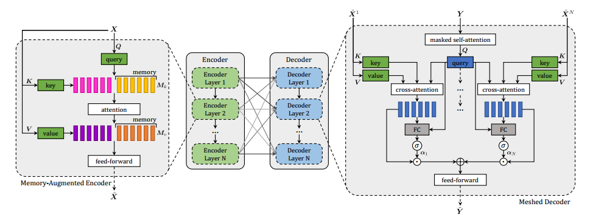
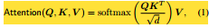
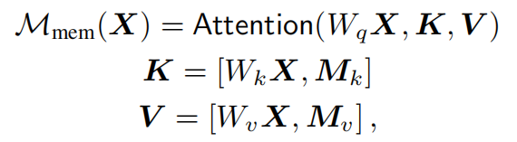
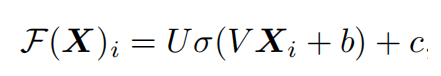
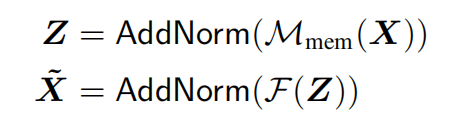
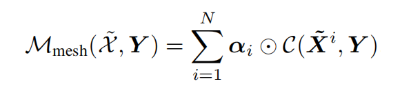
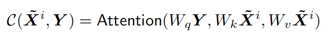
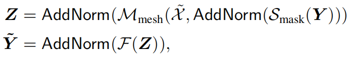

# Meshed-Memory

$M^2$在本质上可以分为编码器和解码器模块，两者都由stacks of attentive layers组成。

对于每一个层：

输入是X，X分为三部分，为QKV，Q是查询矩阵，K、V为键值对。

## Encoder

X是给定图像中提取的一组图像区域，使用transformer的注意力机制获得一个X的排列不变编码（permutation invariant encoding）。文章中只用了一个$S(X)=Attention(W_qX,W_kX,W_vX)$表示。将Query，keys和values绑定。具体为下公式：

其中，Q是nq个查询向量的矩阵，K和V都包含nk个键和值，所有值都具有相同的维度，d是比例系数。

文章首先提到了自注意力机制的局限性，然后提出了一个memory-augmented attention operator。用于self-attention的键和值的集合被扩展为额外的“slots”，它可以编码先验信息。（**a-priori information** means a piece of information about the investigated reality that is not obtained by the measuring instruments that carry out the measurement, but is known from other sources.）

为了强调先验信息不应该依赖于输入集X，键和值被实现为可直接通过SGD（随机梯度下降）更新的普通可学习向量。operator定义如下:

文章将memory-augmented operator嵌入到一个类似于Transformer的层中：memory-augmented attention的输出应用于由两个具有单一非线性的仿射变换组成的位置前馈层，它们独立地应用于集合中的每个元素：

其中，$X_i$表示输入集的第i个向量，$F(X)_i$表示输出的第i个向量。σ(·)是ReLU激活函数，V和U是可学习的权值矩阵，b和c是偏差项。

每个这些子组件然后被封装在一个残差连接和一个归一化操作中。编码层的完整定义最终可以写成：

通过将上面的结构进行堆叠形成了一个完整的编码器。

## Decoder

Decoder也是多层堆叠形成的。

本文提出了一个meshed attention operator，与Transformer的 cross-attention operator不同的是，可以在句子的生成过程中利用所有的encoding layer。

### Meshed Cross-Attention

给定一个向量Y的输入序列，以及来自所有编码层X~的输出，meshed attention operator通过gated cross-attentions将Y连接到X~中的所有元素。不再只关注最后一个编码层，而是对所有编码层进行cross-attention。最后，meshed attention operator定义如下：

其中C(·,·)代表Encoder-Decoder cross-attention，使用Decoder的查询值和Encoder的键和值计算得到：

$α_i$是一个与cross-attention结果具有相同大小的权重矩阵。$α_i$中的权重既调节每个编码层的单个贡献，也调节不同层之间的相对重要性。这些结果是通过测量每个编码层计算的cross-attention结果与输入查询之间的相关性来计算的

### Architecture of decoding layers

对于编码层，以多头的方式应用meshed attention。

由于一个单词的预测应该只依赖于先前预测的单词，解码器层包括一个masked self-attention operation，该操作将从其输入序列Y的第t个元素获得的查询与从左侧子序列获得的键和值连接起来。此外，解码器层包含一个按位置方向的前馈层，所有组件都被封装在AddNorm操作中。解码器层的最终结构可以写成:

其中，Y是向量的输入序列，Smask表示随时间变化的masked self-attention。最后，解码器将多个解码器层堆叠在一起，帮助细化对文本输入的理解和下一个标记的生成。

