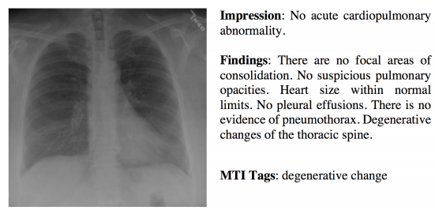

# On the Automatic Generation of Medical Imaging Reports

## Abstract

医学影像广泛应用于临床诊断和治疗。对于没有经验的医生来说，写报告很容易出错，而对于有经验的医生来说，写报告既耗时又乏味。为了解决这些问题，我们研究了医学影像报告的自动生成。这项任务提出了几个挑战。首先，一个完整的报告包含多种异构形式的信息，包括发现和标记。

其次，医学图像中的异常区域难以识别。第三，报告通常很长，包含多个句子。为了应对这些挑战，我们(1)构建了一个多任务学习框架，共同完成标签的预测和段落的生成;(2)提出了一种共同关注机制，用于定位包含异常的区域并为其生成叙述;(3)开发了一种分层LSTM模型，用于生成长段落。我们在两个公开可用的数据集上证明了所提出方法的有效性。

## Introduction

医学图像，如放射学和病理学图像，在医院被广泛用于诊断和治疗许多疾病，如肺炎和气胸。医学影像的阅读和解读通常由专业的医学专业人员进行。

例如，放射学图像由放射科医生阅读。他们撰写文本报告，叙述成像研究中身体每个区域的检查结果。特别是每个区域是否被发现正常、异常或潜在异常。

对于经验不足的放射科医生和病理学家，特别是在医疗质量相对较低的农村地区工作的放射科医生和病理学家来说，撰写医学成像报告是一项繁重的工作。

例如，要正确阅读胸部x线图像，需要以下技能

1. 深入了解胸部的正常解剖结构和胸部疾病的基本生理学;
2. 通过固定模式分析x光片的技能;
3. 评估随时间演变的能力;
4. 了解临床表现和病史;
5. 了解与其他诊断结果(实验室结果、心电图和呼吸功能检查)的相关性

对于经验丰富的放射科医生和病理学家来说，撰写成像报告是乏味而耗时的。对于中国这样人口庞大的国家，每个医生的工作量将是巨大的。

这促使我们研究是否有可能自动生成医学图像报告。有几个挑战需要解决。

首先，一份完整的诊断报告由多种异构形式的信息组成。

如下图所示，胸部x光片的报告包含impression(一个句子)、findings(一个段落)和tags(一个关键字列表)。在统一框架中生成这种异构信息在技术上要求很高。

我们通过构建一个多任务框架来解决这个问题，该框架将标签的预测视为多标签分类任务，并将长描述的生成视为文本生成任务。

其次，如何定位图像区域并对其进行正确的描述是一个挑战。我们通过引入共同关注机制来解决这些问题，该机制同时关注图像和预测标签，并探索视觉和语义信息的协同效应。

第三，影像报告中的描述通常很长，包含多个句子。生成如此长的文本是非常重要的。我们没有采用单层LSTM，因为单层LSTM对长词序列的建模能力较差，而是利用报告的组成性质，采用分层LSTM来生成长文本。结合共同关注机制，分层LSTM首先生成高级主题，然后根据主题生成细粒度（ fine-grained description）描述。

## Methods

NOTE：==医学图像的完整诊断报告由文本描述(长段落)和标签列表组成==

本文提出了一种具有共同关注的多任务分层模型（multi-task hierarchical model with coattention），用于关键词自动预测和长段落自动生成

### Encoding过程

给定一个被划分为多个区域的图像，我们使用==CNN==来学习这些区域的==视觉特征==。然后将这些视觉特征输入到==多标签分类(MLC)网络==中来预测相关标签。

在tag voabulary中，每一个tag都被表示成词嵌入向量。给定特定图像的预测tag，tag的词嵌入向量作为该图像的语义特征。然后将图像的视觉特征和语义特征输入到一个co-attention模型中，生成一个同时捕获图像的视觉和语义信息的上下文向量。编码过程已经完成。

### Decoding过程

